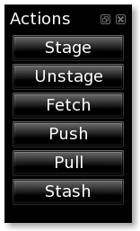

=======
Actions
=======

The `Actions` tool gives you quick access to `git-cola` commands.

Stage
=====
Stages selected files in the index using
`git add <http://www.kernel.org/pub/software/scm/git/docs/git-add.html>`_.

If no files are selected then all modified files are staged.

Unstage
=======
Unstages selected files from the index using
`git reset <http://www.kernel.org/pub/software/scm/git/docs/git-reset.html>`_.

If no files are selected then all staged files are unstaged.

Fetch
=====
Launch an interface for fetching branches from remotes.

See the
`git fetch <http://kernel.org/pub/software/scm/git/docs/git-fetch.html>`_
documentation for more details.

Push
====
Launch an interface for pushing branches to remotes.

See the
`git push <http://kernel.org/pub/software/scm/git/docs/git-push.html>`_
documentation for more details.

Pull
====
Launch an interface for pulling changes from remote branches.

See the
`git pull <http://kernel.org/pub/software/scm/git/docs/git-pull.html>`_
documentation for more details.

Stash
=====
Launch an interface for managing git stashes.

See the
`git stash <http://kernel.org/pub/software/scm/git/docs/git-pull.html>`_
documentation for more details.
