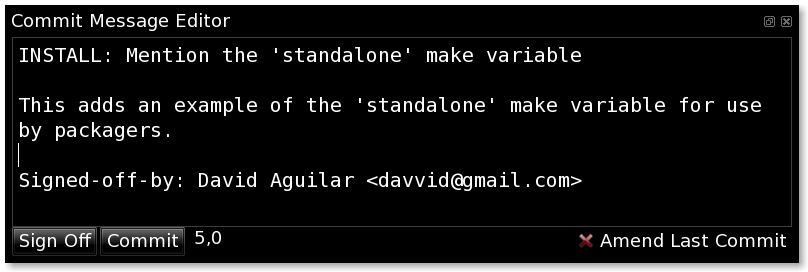

=====================
Commit Message Editor
=====================

The `git-cola` commit message editor is a simple text widget
for entering commit messages.

Sign Off
========
The `Sign Off` button adds the standard::

    Signed-off-by: A. U. Thor <a.u.thor@example.com>

to the bottom of the commit message.

Pressing this button is equivalent to passing the ``-s`` option to
`git commit <http://kernel.org/pub/software/scm/git/docs/git-commit.html>`_.

Commit
======
The commit button runs
`git commit <http://kernel.org/pub/software/scm/git/docs/git-commit.html>`_.
The contents of the commit message editor is provided as the commit message.

Only staged files are included in the commit -- this is the same behavior
as running ``git commit`` on the command-line.

Line and Column Display
=======================
The current line and column number is displayed below the text entry area.
The ``5,0`` display in the image means that the cursor is located at
line five, column zero.

The display changes colors as lines start getting too long.
Yellow indicates the safe boundary for sending patches to a mailing list
and keeping space for inline reply markers.

Orange indicates that the line is starting to run a bit long and should
break soon.

Red indicates that the line is running up against the standard
80-column limit for commit messages.

Commit messages with lines longer than 80 characters are discouraged.
`git log <http://www.kernel.org/pub/software/scm/git/docs/git-log.html>`_
is a powerful command-line tool so obeying the convention of keeping
commit messages within the 80-character terminal width is highly encouraged.

Amend Last Commit
=================
Clicking on `Amend Last Commit` makes `git-cola` amend the previous commit
instead of creating a new one.  `git-cola` loads the previous commit message
into the commit message editor when this option is selected.

The `Repository Status` tool will display all of the changes for the
amended commit.  All files that changed in the amended commit will show
up as `Staged`.
