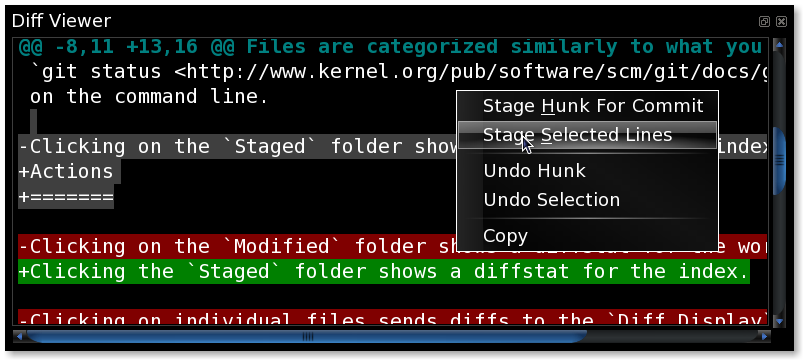

===========
Diff Viewer
===========

The `git-cola` diff view allows you to interactively stage
and unstage content in the git index.

Highlighting
============
Additions are shown in green and removals are displayed in light red.
Extraneous whitespace is shown in a pure red background.

Diff Regions
============
The ``@@`` patterns denote each diff region.  Selecting lines of diff
and using the `Stage Selected` command will stage just the selected fragment.
Clicking within a diff region and selecting the `Stage Section` stages that
region.  The corresponding opposite commands can be performed on staged
files as well.

Keyboard Shortcuts
==================
* :command:`h` -- Stage/unstage section at text cursor position.
* :command:`s` -- Stage/unstage selection.  If nothing is selected then
  this is equivalent to the :command:`h` shortcut.

Right-click Actions
===================
The `Diff Viewer` tool has various actions that
are available through its right-click context menu.

Different actions are available depending a file's status.

Modified Files
--------------
Stage Section
    Add the diff region at the cursor position to the index.

Stage Selected Lines
    Add selected diff lines to the index.
    This corresponds to the gray lines in the image.

Revert Section
    Apply a reverse patch to the worktree.
    This reverts unstaged modifications to a file.

Revert Selected Lines
    Apply a subset of the reverse patch to the worktree.

Staged Files
------------
Unstage Section
    Remove the diff region at the cursor position from the index.

Unstage Selected Lines
    Remove selected diff lines from the index.
