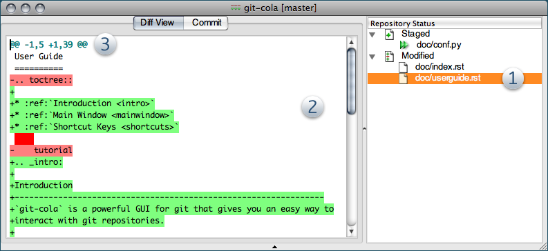

=============
The Interface
=============

Cooperating Tools
=================
The `git-cola` interface is composed of various cooperating tools.

Double-clicking a tool opens it in its own subwindow.

Dragging it around moves and places it within the window.

    `git-cola` 1.3.x running on Mac OSX

Repository Status (1)
---------------------
The repository status view displays paths that git detects as either
staged for the next commit (`Staged`),
modified relative to the staging area (`Modified`), or
an unresolved file from a merge (`Unmerged`).

A file can be staged or unstaged by either double-clicking on its name or
single-clicking on its icon.  Right-clicking on an entry displays additional
actions that can be performed such as launching `git-difftool` or
`git-mergetool`.

Diff Viewer (2)
---------------
The diff viewer displays diffs for selected files.
Additions are shown in green and removals are displayed in light red.
Extraneous whitespace is shown in a pure red background.

Right-clicking in the diff viewer provides access to additional actions
that can operate on the cursor location or selection.

Diff Regions (3)
----------------
The ``@@`` patterns denote each diff region.  Selecting lines of diff
and using the `Stage Selected` command will stage just the selected fragment.
Clicking within a diff region and selecting the `Stage Hunk` stages that
region.  The corresponding opposite commands can be performed on staged
files as well.

Drag and Drop `git am`
======================
Dragging and dropping patches onto the `git-cola` interface
applies patches using
`git am <http://www.kernel.org/pub/software/scm/git/docs/git-am.html>`_

You can drag either a set of patches or a directory containing patches.
All files are sorted alphanumerically before being applied.
This means that patches named ``0001-foo.patch`` are applied
before ``0002-bar.patch``.

When a directory is dropped `git-cola` walks the directory
tree in search of patches.  `git-cola` sorts the list of
patches after they have all been found.  This allows you
to control the order in which patchs are applied by placing
patchsets into alphanumerically-sorted directories.

Custom GUI Layouts
==================
`git-cola` remembers modifications to the layout and arrangement
of tools within the `git-cola` interface.  Changes are saved
and restored at application shutdown/startup.

`git-cola` can be configured to not save custom layouts--
simply uncheck the `Save Window Settings` option in the
`git-cola` preferences.
