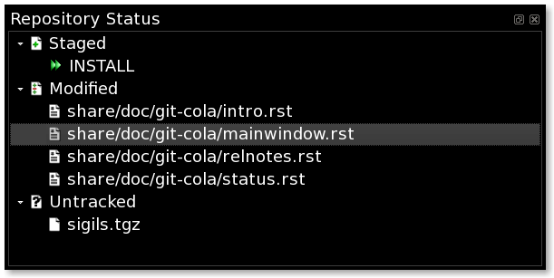

=================
Repository Status
=================

The status tool shows you a quick summary of the
state of the entire project.

Files are categorized similarly to what you'd see when running
`git status <http://www.kernel.org/pub/software/scm/git/docs/git-status.html>`_
on the command line.

Actions
=======

Clicking the `Staged` folder shows a diffstat for the index.

Clicking the `Modified` folder shows a diffstat for the worktree.

Clicking individual files sends diffs to the `Diff Display`.

Double-clicking individual files adds and removes their content from the index.

Right-click Actions
===================
The `Repository Status` tool has various actions that
are available through its right-click context menu.

Different actions are available depending a file's status.

Staged Files
------------
Unstage Selected
    Remove from the index/staging area with
    `git reset <http://www.kernel.org/pub/software/scm/git/docs/git-reset.html>`_

Launch Editor
    Launch the configured visual editor

Launch Difftool
    Visualize changes with
    `git difftool <http://www.kernel.org/pub/software/scm/git/docs/git-difftool.html>`_

Revert Unstaged Edits
    Throw away unstaged edits.

Modified Files
--------------
Stage Selected
    Add to the staging area with
    `git add <http://www.kernel.org/pub/software/scm/git/docs/git-add.html>`_

Launch Editor
    Launches the configured visual text editor

Launch Difftool
    Visualize changes relative to the index with
    `git difftool <http://www.kernel.org/pub/software/scm/git/docs/git-difftool.html>`_

Revert Unstaged Edits
    Reverts unstaged content by checking out selected paths
    from the index/staging area

Revert Uncommited Edits
    Throws away uncommitted edits

Unmerged Files
--------------
Launch Merge Tool
    Resolve conflicts using
    `git mergetool <http://www.kernel.org/pub/software/scm/git/docs/git-mergetool.html>`_

Stage Selected
    Mark as resolved using
    `git add <http://www.kernel.org/pub/software/scm/git/docs/git-add.html>`_

Launch Editor
    Launch the configured visual text editor

Untracked Files
---------------
Stage Selected
    Add to the index/staging area with
    `git add <http://www.kernel.org/pub/software/scm/git/docs/git-add.html>`_

Launch Editor
    Launch the configured visual text editor

Delete File(s)
    Delete files from the filesystem
    
Add to .gitignore
	Adds file/files to GIT ignore list for untracked files
